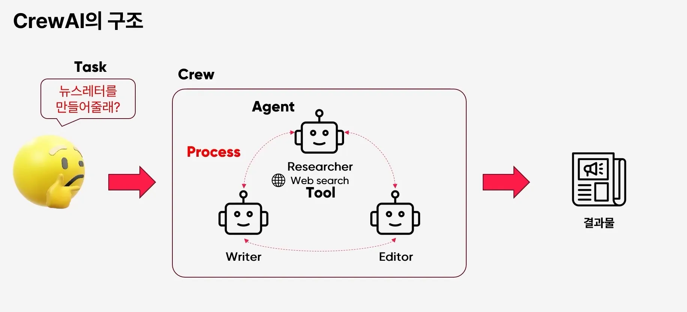
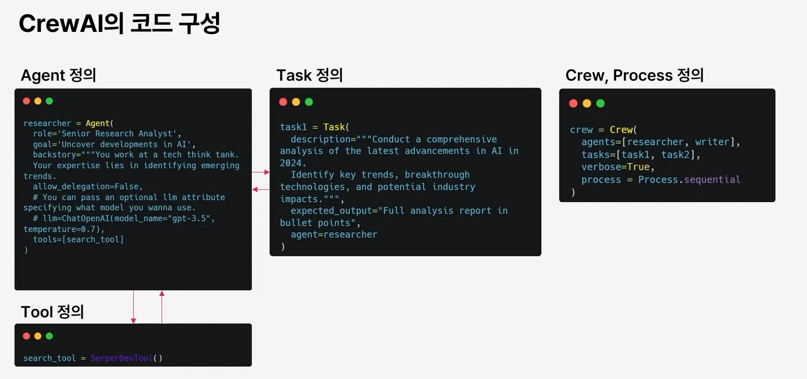
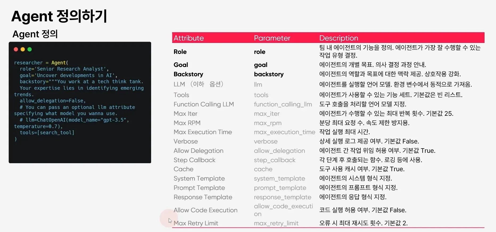
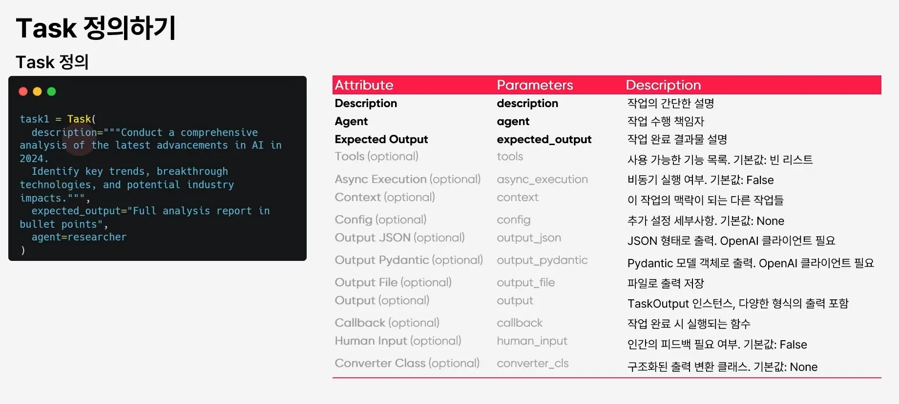
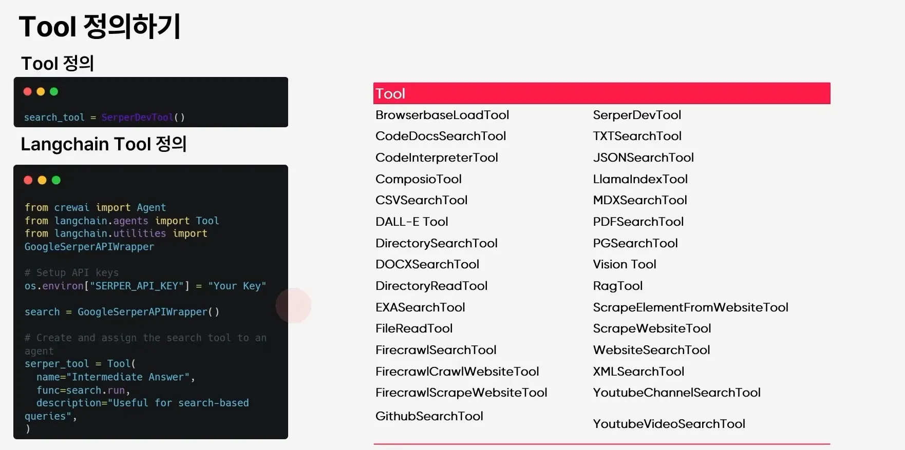
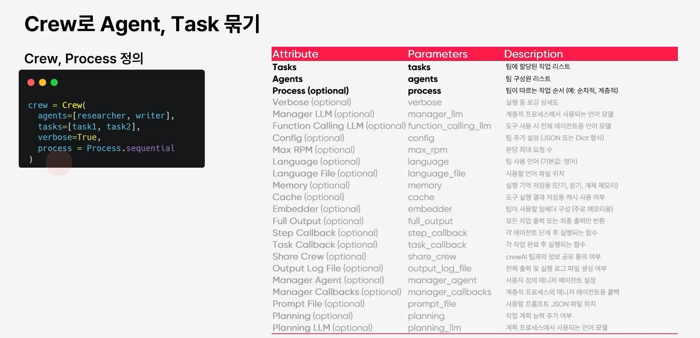

## 세팅
`pip install virtualenv`
`python -m virtualenv venv`
`.\venv\Scripts\activate` (windows)

## 실행
`.\venv\Scripts\python crew_ai.py`

## CrewAI의 구조

CrewAI는 Task, Crew, Agent, Tool, Process만 신경쓰면된다.

- Task: 사용자가 원하는 목표, 예상되는 수행 결과를 정의한다. 상세하게 정의할수록 에이전트가 보다 올바른 동작을 수행한다.
- Crew: 여러 Agent로 묶여있는 Tool이다. Agent 구성은 원하는 갯수만큼 구성할 수 있다. CrewAI는 원하는 Task에 맞게 Crew를 정의하는 것이 중요하다.
- Process: Agent들이 일하는 방식을 설정한다. Optional하며 설정하지 않으면 Agent들이 알아서 각자가 일하는 방식을 정의하고 동작한다. Agent의 호출 흐름을 직접 정의하고 제어해야한다면 설정한다.

## CrewAI의 코드 구성

### Agent 정의

Agent 정의에서 중요한게 allow_delegation 옵션이다. 이는 에이전트가 다른 에이전트를 호출하는 것을 허용하는 옵션인데, True로 두면 Agent가 자꾸 다른 Agent를 호출하여 Agent간에 루프가 발생할 수 있어 추천하지 않는다.

### Task 정의

description에 수행할 목표를 정의하고 expected_output에 원하는 결과물의 형식을 정의한다.

agent에는 만약 Task를 특정 Agent에게 종속시키고 싶다면 정의한다. Crew안에 여러개의 Task가 들어갈 수 있기에 정의하는 것을 추천한다.

### Crew 정의

Crew안에 사용할 agent, task를 정의하고 verbose를 설정하여 Agent의 업무 수행 과정을 디버깅해볼 수 있다. 개발모드를 활성화하는 의미와 유사하다.

process 옵션을 통해 전체 프로세스가 어떻게 동작할지를 정해줄 수 있다.

## Agent 정의하기

## Task 정의하기

## Tool 정의하기

## Crew 정의하기
